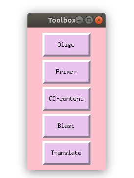

# Toolbox
This is a project I did during a project week for the course Binp16 - Bioinformatics: Programming in Python

The project week allowed us to choose any project and I choose one where I could explore the possibilities to make programs with a graphical user interface, using the module **tkinter**.

## Description
I have created a graphical user interface toolbox for DNA sequences. The program provides 5 different buttons, with different funtions.

**1. Permute** 
  * This button will take a sequence and return all different permutations possible. One can then choose any of sequences and use as a primer in the primer function.
  
**2. Primer**
  * This button will allow you to enter a primer, and search a sequence for that primer.
  
**3. GC-content**
  * This button will calculate the GC-content of a sequence and plot it.
  
**4. Blast**
  * This button will take a nucleotide sequence and run it against the BLAST database
  
**5. Translate**
  * This button will take a nucleotide sequence and translate it to the corresponding aminoacid sequence in all frames and directions
  

## Configuration

In the file **Toolbox.py** The variable "HOME_DIR" needs to be changed to the absolute path of where the file is located.

required python packages:

The toolbox will open when the script is executed.

