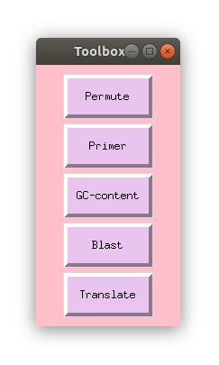
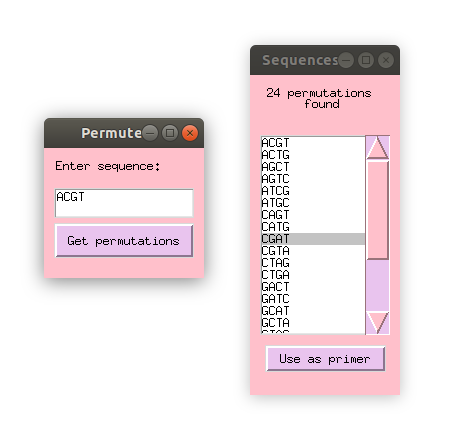

# Toolbox
This is a project I did during a project week for the course Binp16 - Bioinformatics: Programming in Python

The project week allowed us to choose any project and I choose one where I could explore the possibilities to make programs with a graphical user interface, using the module **tkinter**.

## Description
I have created a graphical user interface toolbox for DNA sequences. The program provides 5 different buttons, with different funtions.

**1. Permute** -
This button will take a sequence and return all different permutations possible. One can then choose any of sequences and use as a primer in the primer function.
  
**2. Primer** -
This button will allow you to enter a primer, and search a sequence for that primer.
  
**3. GC-content** -
This button will calculate the GC-content of a sequence and plot it.
  
**4. Blast** -
This button will take a nucleotide sequence and run it against the BLAST database
  
**5. Translate** -
This button will take a nucleotide sequence and translate it to the corresponding aminoacid sequence in all frames and directions
  

## Configuration

In the file **Toolbox.py** The variable "HOME_DIR" needs to be changed to the absolute path of where the file is located.

Install miniconda to create a conda environment:
### For Windows users
Download and install Miniconda3 - https://repo.anaconda.com/miniconda/Miniconda3-latest-Windows-x86_64.exe

in Anaconda prompt (Miniconda3) run commands:
```python
conda create --name toolbox-env python=3.8.3
conda activate toolbox-env
conda install matplotlib
pip install Bio
```
now run Toolbox.py

### For Linux users
Download miniconda - https://repo.anaconda.com/miniconda/Miniconda3-latest-Linux-x86_64.sh

In bash terminal run:
```bash
$ bash ~/Downloads/Miniconda3-latest-Linux-x86_64.sh
$ conda create --name toolbox-env python=3.8.3
$ conda activate toolbox-env
$ conda install matplotlib
$ pip install Bio
```
now run Toolbox.py

<p align="center">

</p>

## Permute Button

Pressing this button will pop up a window where one can write any sequence and get the different permutations provided from it.

<p align="center">

</p>

## Primer Button

The primer function will allow you to write a sequence containing one or several of the 11 bases provided. You can chose to see what possible sequences the primer can represent, or search in a fasta file for any of the possible sequences generated from the primer.


<p align="center">

</p>

## GC-Content Button

This function will allow you to write a sequence or add a sequence from an existing fasta file, and generate a plot with the GC-content of the sequence in different positions. One can choose the size of the window where the GC content is calculated, and how many steps to move forward in the sequence for each calculation

<p align="center">

  
## Blast Button

The Blast button will search the NCBI database for the given sequence, and return a file containing all matches found.
<p align="center">

</p>

## Translate Button

The Translation function will take a nucleotide sequence and translate it to the corresponing aminoacid sequence in all different frames.

<p align="center">

</p>
